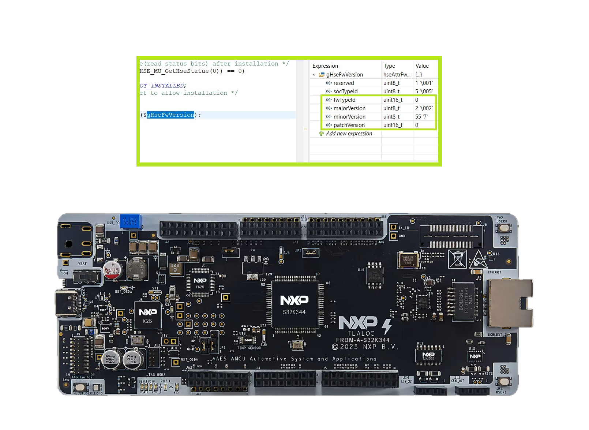
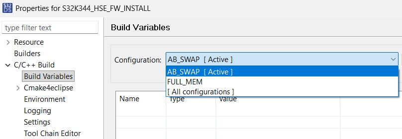
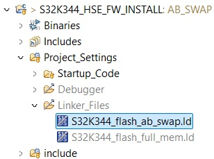
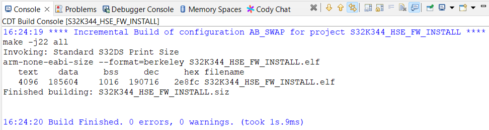
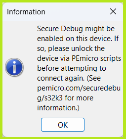
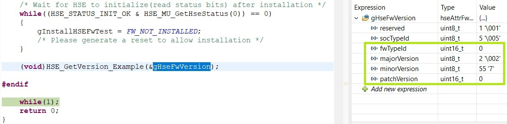

# NXP Application Code Hub
[](https://www.nxp.com)

## Install HSE Firmware on S32K344

This example shows how to install the HSE (Hardware Security Engine) firmware on an S32K344 device using the IVT (Image Vector Table) method. The application programs the HSE firmware usage flag in the UTEST memory, and upon a Power-On Reset the sBAF (secure Boot Assist Flash) installs the HSE firmware into the secure Flash memory.

The project supports both the **FULL_MEM** and **AB_SWAP** memory configurations, selected via the build configuration. After installation, the firmware reads back and stores the installed HSE firmware version attribute. An optional erase path is provided to remove a previously installed HSE firmware image.

This demo is used to install HSE Firmware, a requirement for the [Secure Encrypted Ethernet Communication](https://mcuxpresso.nxp.com/appcodehub?search=dm-secure-encrypt-eth-frdm-a-s32k344) example from [Application Code Hub](https://mcuxpresso.nxp.com/appcodehub).
[<p align="center"></p>](./images/FRDM-A-S32K344-HSE-Firmware.png)

#### Boards: FRDM-A-S32K344
#### Categories: Security
#### Peripherals: FLASH
#### Toolchains: S32 Design Studio IDE

## Table of Contents
1. [Software and Tools](#step1)
2. [Hardware](#step2)
3. [Setup](#step3)
4. [Results](#step4)
5. [Support](#step5)
6. [Release Notes](#step6)

## 1. Software and Tools<a name="step1"></a>

This example was developed using the FRDM Automotive Bundle for S32K3 + S32M27. To download and install the complete software and tools ecosystem, use the following link:
- [ FRDM Automotive S32K3 + S32M27 Board Installation Package](https://www.nxp.com/app-autopackagemgr/automotive-software-package-manager:AUTO-SW-PACKAGE-MANAGER?currentTab=0&selectedDevices=S32K3&applicationVersionID=203)
- ```HSE_FW_S32K344_0_2_55_0_D2502.exe``` from [Automotive Software Package Manager -> S32K344 HSE Standard Firmware](https://www.nxp.com/app-autopackagemgr/software-package-manager:AUTO-SW-PACKAGE-MANAGER?currentTab=1&selectedDevices=S32K3&productReleaseVersionID=674)

## 2. Hardware<a name="step2"></a>

### 2.1 Required Hardware
This example requires the following hardware in order to properly execute:
- Personal Computer
- USB Type-C cable
- [FRDM-A-S32K344](https://www.nxp.com/design/design-center/development-boards-and-designs/FRDM-S32K344)<p><p/>

### 2.2 Debugger Connection
- Connect the Type-C USB cable to PC and FRDM-A-S32K344 board for power supply and debugging

## 3. Setup<a name="step3"></a>

### 3.1 Import the Project into S32 Design Studio IDE
1. Open S32 Design Studio IDE, in the Dashboard Panel, choose **Import project from Application Code Hub**.
   [<p align="center"></p>](./images/import_project_1.png)

2. Find the demo by searching: [Install HSE Firmware on S32K344](https://mcuxpresso.nxp.com/appcodehub?search=dm-hse-firmware-S32K344)

3. Open the project, click the **GitHub link**, S32 Design Studio IDE will automatically retrieve project attributes, then click **Next>**.
   [<p align="center"></p>](./images/import_project_3.png)

4. Select **main** branch and then click **Next>**.

5. Select your local path for the repo in **Destination->Directory:** window. The S32 Design Studio IDE will clone the repo into this path, click **Next>**.

6. Select **Import existing Eclipse projects** then click **Next>**.

7. Select the project in this repo (only one project in this repo) then click **Finish**.

### 3.2 Download the HSE-B Firmware
1. Go to [Automotive Software Package Manager -> S32K344 HSE Standard Firmware](https://www.nxp.com/app-autopackagemgr/software-package-manager:AUTO-SW-PACKAGE-MANAGER?currentTab=1&selectedDevices=S32K3&productReleaseVersionID=674), create an account and request access to the secure files.
2. Once access has been granted, download and run the HSE-B Firmware installer for the S32K344. This example uses the version ```HSE_FW_S32K344_0_2_55_0_D2502.exe```.
3. Keep the default installation path ```C:\NXP\```. The installer creates one folder per memory layout, each containing the signed (*pink*) HSE FW binary:

   | Memory configuration | Pink HSE FW binary (default installation) |
   |----------------------|-------------------------------------------|
   | **FULL_MEM** | `C:\NXP\HSE_FW_S32K344_0_2_55_0\hse_full_mem\hse\bin\s32k3x4_hse_fw_0.5.0_2.55.0_pb250130.bin.pink` |
   | **AB_SWAP**  | `C:\NXP\HSE_FW_S32K344_0_2_55_0\hse_ab_swap\hse\bin\s32k3x4_hse_fw_1.5.0_2.55.0_pb250130.bin.pink`  |

### 3.3 Prerequisites (before building)
Prior to building and executing the code, the user needs to:

1. Select the build configuration that matches the memory configuration required by the application (either **FULL_MEM** or **AB_SWAP**). In the **Project Explorer**, right-click the project, then choose **Build Configurations -> Set Active**:
   [<p align="center"></p>](./images/SelectConfig.jpg)

2. Open the linker file corresponding to the selected configuration, located in `Project_Settings/Linker_Files/`, and update the path of the pink HSE FW binary so that it matches the location on your computer. The path appears **twice** in the linker file, on **line 39** (the `INPUT (...)` directive) and on **line 79** (inside the `.hse_bin` section):
   [<p align="center"></p>](./images/LinkerFileLocation.jpg)

   | Build configuration | Linker file to edit |
   |---------------------|---------------------|
   | **FULL_MEM** | `Project_Settings/Linker_Files/S32K344_flash_full_mem.ld` |
   | **AB_SWAP** | `Project_Settings/Linker_Files/S32K344_flash_ab_swap.ld` |

   >**Note**: If the HSE FW was installed in the default path ```C:\NXP\``` and the same firmware version is used (`0_2_55_0`), no change is required - the linker files already point to those locations.

### 3.4 Building and Running the Example

The HSE firmware installation requires **two debug sessions**, with a Power-On Reset (POR) in between:

| Debug session | What the code does | Meaning |
|---------------|--------------------|---------|
| **1st session** | Enters the flag-programming branch in `main.c` and then stays in the HSE status wait loop | HSE FW is **not installed yet** - a POR is required |
| **2nd session** | S32 Design Studio shows the **Secure Debug enabled** message and the code runs directly to `while(1);` | HSE FW is **installed and running** |

#### Step 1 - Build the project

1. Make sure the desired build configuration (**FULL_MEM** or **AB_SWAP**) is active, as described in [section 3.3](#step3).
2. In the **Project Explorer**, right-click the project and select **Build Project**.
3. Confirm that the build completes successfully and that the `.elf` file is generated without errors:
   [<p align="center"></p>](./images/build_successfully.png)

#### Step 2 - First debug session: program the HSE FW usage flag

1. Go to **Run -> Debug Configurations**. Two debug configurations are provided with this project, one per memory layout:

   | Configuration name | Description |
   |--------------------|-------------|
   | `FRDM_A_S32K344_HSE_FW_INSTALL_Debug_FULL_MEM_PNE` | Debug the **FULL_MEM** configuration using a PEmicro probe (loads `FULL_MEM/FRDM_A_S32K344_HSE_FW_INSTALL.elf`) |
   | `FRDM_A_S32K344_HSE_FW_INSTALL_Debug_AB_SWAP_PNE` | Debug the **AB_SWAP** configuration using a PEmicro probe (loads `AB_SWAP/FRDM_A_S32K344_HSE_FW_INSTALL.elf`) |

2. Select the debug configuration matching the build configuration you built and click **Debug** to load the application into the device. The perspective changes to the **Debug Perspective**, where the controls can be used to manage the program flow.

3. Run the application and observe that execution enters the following branch in `main.c`:

   ```c
   /* Check if HSE FW usage flag is already enabled. Otherwise program the flag */
   if(FALSE == checkHseFwFeatureFlagEnabled())
   ```

   This confirms the HSE FW usage flag in UTEST is still at its erased value, so the application unlocks the UTEST memory and programs the flag value `0xAABBCCDDDDCCBBAA`.

4. Execution then reaches the HSE status wait loop and remains stuck there (`gInstallHSEFwTest = FW_NOT_INSTALLED`):

   ```c
   /* Wait for HSE to initialize(read status bits) after installation */
   while((HSE_STATUS_INIT_OK & HSE_MU_GetHseStatus(0)) == 0)
   ```

   This is the expected behavior: the HSE firmware is not installed yet, so the `HSE_STATUS_INIT_OK` bit is never set.

5. **Terminate/disconnect** the debug session and **generate a Power-On Reset (POR)** on the MCU (remove and re-apply the board power). During this reset the sBAF installs the HSE firmware into the secure Flash memory.

#### Step 3 - Second debug session: confirm the HSE FW is installed

1. Start a **new debug session** using the same debug configuration.
2. S32 Design Studio now displays the message below, which means **Secure Debug has been enabled** - the HSE firmware is installed and running on the device:
   [<p align="center"></p>](./images/SecureDebugEnabled.png)

3. Run the application. This time the code does **not** enter the flag-programming branch (the flag is already programmed) and the HSE status wait loop exits immediately, so execution goes directly to `while(1);` at the end of `main()`.
4. Halt the target and check the `gHseFwVersion` variable in the **Variables** or **Expressions** view - it holds the installed HSE firmware version. The installation is complete:
   [<p align="center"></p>](./images/HSEFWInstallationSuccesful.jpg)

>**Note**: Once the HSE firmware is installed and Secure Debug is enabled, this message will appear on every subsequent debug session. To remove the installed firmware, build the project with the `ERASE` macro defined in `main.c` (see the [Results](#step4) section).

## 4. Results<a name="step4"></a>

### Application Behavior

The steps followed by the application are:
1. Verify the HSE usage flag in the UTEST memory.
2. If the HSE usage flag is still at its default (erased) value, the application unlocks the UTEST memory and writes the flag value `0xAABBCCDDDDCCBBAA` to enable the HSE feature.
3. Verify the status of the HSE.
4. If the HSE has **not** started, it means the firmware has not been installed yet; the user must **generate a Power-On Reset** to trigger the installation via the sBAF.
5. Once the HSE has started (`HSE_STATUS_INIT_OK`), the application requests the HSE firmware version attribute and stores the version details in a variable (`gHseFwVersion`).

### Expected Result

A successful installation is confirmed by the observations described in [section 3.4](#step3):
- In the second debug session, S32 Design Studio displays the **Secure Debug enabled** message.
- The application no longer waits for the HSE status and runs directly to `while(1);` in `main.c`, with the `gHseFwVersion` variable holding the installed HSE firmware version:
   [<p align="center"></p>](./images/HSEFWInstallationSuccesful.jpg)

### Removing an Installed HSE Firmware

An optional **ERASE** path is available in `main.c`. Uncomment the `ERASE` macro at the top of the file, rebuild and run the project. In this mode the application waits for the HSE to initialize and then requests the `HSE_SRV_ID_ERASE_FW` service, which removes the Sys-Img, the backup and the currently running HSE FW from Flash:

```c
#define ERASE
```

### Source Files of Interest

| File                             | Purpose                                                                  |
|----------------------------------|--------------------------------------------------------------------------|
| `src/main.c`                     | Application entry point: UTEST flag programming, HSE init wait, get/erase FW version |
| `src/hse_host.c/.h`              | HSE host driver: MU messaging, service send, and response handling       |
| `src/hse_host_attrs.c/.h`        | HSE attribute helpers (e.g. get FW version attribute)                    |
| `Project_Settings/Linker_Files/` | Linker files (FULL_MEM/ AB_SWAP) defining the pink HSE FW image location |
| `Project_Settings/Debugger/`     | PEmicro debug launch configurations (FULL_MEM / AB_SWAP)                 |

## 5. Support<a name="step5"></a>

For general technical questions related to NXP microcontrollers, please use the [NXP Community Forum](https://community.nxp.com/).

#### Project Metadata

<!----- Boards ----->
[](https://mcuxpresso.nxp.com/appcodehub?boards=FRDM-A-S32K344)

<!----- Categories ----->
[](https://mcuxpresso.nxp.com/appcodehub?category=security)

<!----- Peripherals ----->
[](https://mcuxpresso.nxp.com/appcodehub?peripheral=flash)

<!----- Toolchains ----->
[](https://mcuxpresso.nxp.com/appcodehub?toolchain=s32_design_studio_ide)

Questions regarding the content/correctness of this example can be entered as Issues within this GitHub repository.

>**Note**: For more general technical questions regarding NXP Microcontrollers and the difference in expected functionality, enter your questions on the [NXP Community Forum](https://community.nxp.com/)

[](https://www.youtube.com/NXP_Semiconductors)
[](https://www.linkedin.com/company/nxp-semiconductors)
[](https://www.facebook.com/nxpsemi/)
[](https://x.com/NXP)

## 6. Release Notes<a name="step6"></a>

| Version | Description / Update                           | Date                           |
|:-------:|------------------------------------------------|-------------------------------:|
| 1.0     | Initial release on Application Code Hub        | September 17<sup>th</sup> 2026 |
